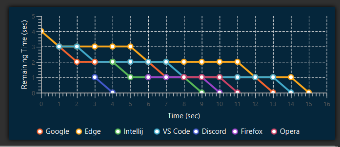

<div style="display: flex; justify-content: space-between;">
  
  <a href="https://github.com/AhmedBakrXI/Panda-Scheduler">
    
  </a>
  
</div>


<h3 align="center"> Panda Scheduler </h3>

An educational desktop application that simulates the CPU scheduling algorithms. The application is designed to help students understand the concepts of CPU scheduling algorithms by visualizing the process of scheduling and executing processes on the CPU.


### Built with

- Java
- JDK 20
- Maven
- JavaFX 21
- [MaterialFX](https://github.com/palexdev/MaterialFX)

## Setup
This application works on [Windows/Linux/MacOS].

### Prerequisite
- You should have jre 20 or above installed.

### Installation

You can download the app from this [link](https://drive.google.com/drive/folders/1G21NE5N9AGt7oIYzIMnOConbIEMn5A6f?usp=sharing) and run .exe or .jar.

## Features

### 6 Types of Scheduling Algorithms

- First Come First Serve (FCFS)
- Shortest Job First: Preemptive & Non-Preemptive
- Priority Scheduling: Preemptive & Non-Preemptive
- Round Robin (RR)
    
### 2 Types of Simulation

**Interactive Simulation**

- The scheduler progresses through the processes step by step via user's click.
- Allows the user to pause/resume the simulation at any time.

**Live Simulation**

- The scheduler progresses through the processes automatically in real-time.
- Allows the user to add new processes to the scheduler while the simulation is running.

### Process Table

- Allows the user to easily add processes via an easy-to-use form.
- Displays all details of the processes during the simulation.

### Visualization via charts

Includes 2 types of charts to enhance grasping the concepts of the scheduling algorithms:

**Gantt Chart**: Displays the timeline of the processes execution on the CPU.


**Line Chart**: Displays each process's status, start time, remaining time and end time.



In addition to calculating the average waiting time and turnaround time for the processes.

### Light and Dark Mode

The application supports both light and dark modes.


## Usage

1- In the control section, select the desired scheduling algorithm.

2- Input the details each process in the fields provided then click the "Add Process" button.

3- Check the "Live Simulation" checkbox if you want to run the simulation in real-time. Don't check it if you want to run the simulation step by step.

4- Click the "Start Simulation" button to start the simulation.

5- If you didn't check the "Live Simulation" checkbox, click the "Start Simulation" button to proceed to the next step in the simulation.

6- If you checked the "Live Simulation" checkbox, you can add new processes to the scheduler while the simulation is running.

7- The simulation will end when all processes are executed.

8- To run a new simulation, click the reset button.


## Development

### Prerequisites

- You must have jdk 20 or above installed.
- You should have a version of maven that supports jdk 20 installed.

### Installation

- Clone the repo.
```
git clone https://github.com/AhmedBakrXI/Panda-Scheduler.git
```

### Run

- Open the terminal and type
```
mvn compile javafx:run
```


## Collaborators 


<table align="center">
  <tbody>
    <tr>
      <td align="center" valign="top" width="33.33%"><a href="https://github.com/FathyAbdlhady"><br /><sub><b>Fathy Abdelhady</b></sub></a><br />😎</td>
      <td align="center" valign="top" width="33.33%"><a href="https://github.com/MrMariodude"><br /><sub><b>Omar Saleh</b></sub></a><br />😏</td>
      <td align="center" valign="top" width="33.33%"><a href="https://github.com/youssefashmawy"><br /><sub><b>Yousef Ashmawy</b></sub></a><br />🐍</td>
    </tr>
    <tr>
      <td align="center" valign="top" width="33.33%"><a href="https://github.com/waelmarwan7"><br /><sub><b>Marwan Wael</b></sub></a><br />🤨</td>
      <td align="center" valign="top" width="33.33%"><a href="https://github.com/AhmedBakrXI"><br /><sub><b>Ahmed Bakr</b></sub></a><br />☕</td>
      <td align="center" valign="top" width="33.33%"><a href="https://github.com/Deadreyo"><br /><sub><b>Ahmed Atwa</b></sub></a><br />🐱‍👤</td>
    </tr>
  </tbody>
</table>

